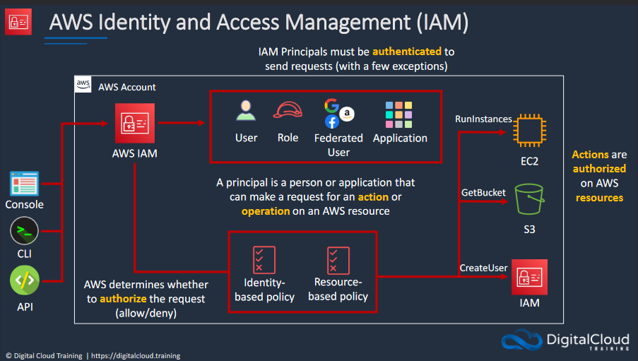
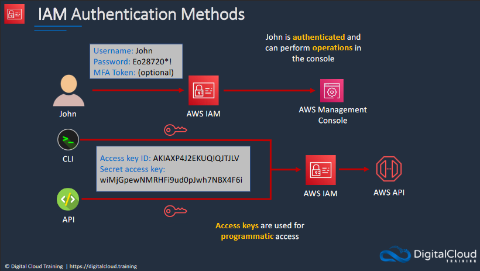
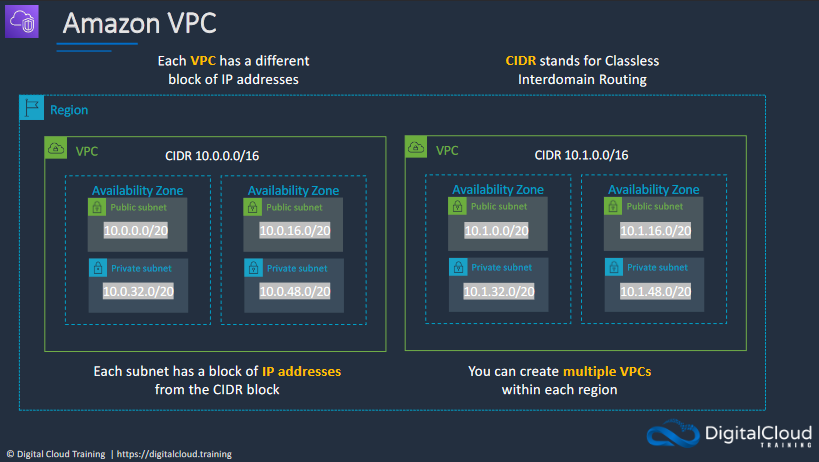
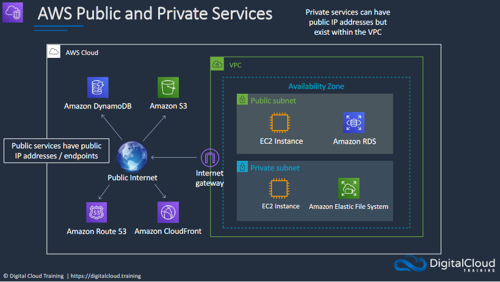
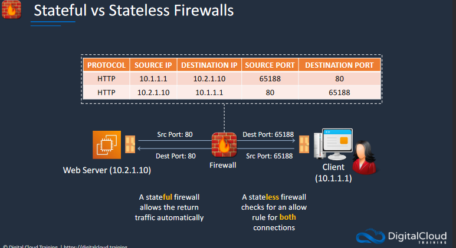
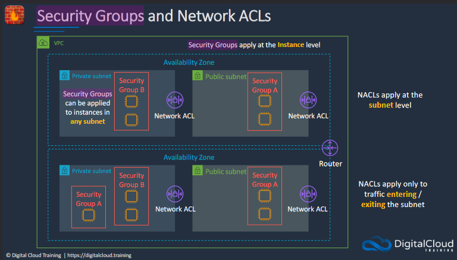
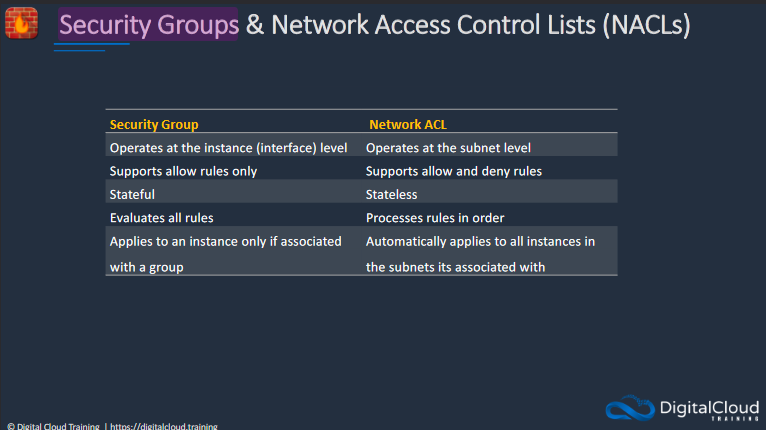
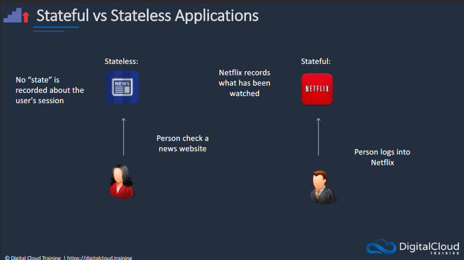

# AWS
## IAM Overview (IAM)
### AWS Identity and Access Management (IAM)

AWS Identity and Access Management (IAM) is a service that helps you control access to AWS resources. It allows you to create and manage users, groups, and permissions securely.

### IAM Authentication Methods

IAM Authentication Methods refer to the ways users and services prove their identity to access AWS resources. These methods include username/password, access keys for API calls, and roles assumed by services or federated users.

---
## Amazon VPC

Amazon VPC (Virtual Private Cloud) is a service provided by AWS (Amazon Web Services) that allows you to create an isolated, private network in the cloud. With a VPC, you can define your own network space with IP address ranges, subnets, and security settings. This enables you to run resources like EC2 instances or databases securely and with fine-grained control over network configuration and accessibility.

A subnet, or subnetwork, is a smaller, segmented part of a larger network. It allows you to divide a network into smaller, more manageable pieces for purposes like security, traffic management, or resource allocation. Each subnet has its own unique IP address range, which is a subset of the larger network's IP address range. In the context of an Amazon VPC, you can create multiple subnets to isolate different types of resources or to configure specific access rules.

NAT-gateways is the part that costs money when creating and using VPCs. If you don't know if you're going to use it or don't need it, you can get rid of it by doing this: 

VPC -> NAT gateways -> Actions -> Delete NAT Gateway

When you delete the NAT gateway it's still going to leave behind the elastic IP-adress. You only pay for elastic IPs when you're not using them. In this case we need to delete it by following these steps: 

VPC -> Elastic IPs -> Actions -> Release Elastic IP Addresses

It shouldn't cost us anything since the NAT Gateway was only active for a few minutes and the Elastic IP was only detached for a couple of seconds (from tutorial). 

Why should you use a NAT-gateway? Without a NAT Gateway, resources in private subnets won't be able to access the internet directly. They can still communicate within the VPC and with other AWS services that are configures to allow such traffic. Internet is not a requirement depending on our use case, operating without a NAT Gateway is entirely feasible.

AWS Public Services are accessible over the internet and include services like S3 and EC2. Private Services are only accessible within your VPC, such as VPC endpoints or private RDS instances.

---

## Stateful vs Stateless Firewalls

Stateful and stateless firewalls are two types of firewalls that filter network traffic based on different criteria:

* **Stateful Firewalls:** These keep track of the state of active connections and make decision based on the context of the traffic, such as TCP handshake completion or established sessions. This allows them to apply rules based on the entire communcation session, not just individual packets. Stateful firewalls are more secure and flexible but can require more processing power.

* **Stateless Firewalls:** These filter traffic based on the source and destination without considering the state of the connection. Each packet is inspected individually and either accepted or rejected based on pre-set rules. Stateless firewalls are faster and require less memory because the don't keep track of connection states, but they are generally considered less secure compared to stateful firewalls.

The choice between stateful and stateless firewalling depends on your specific needs for performance, security and complexity

Security Groups and Network Access Control Lists (ACLs) are both used for configuring network security in Amazon VPC, but they operate at different levels and offer different types of control.

Now, what's the differences between Security Groups and Network ACL (NACLs)?

---

## Stateful vs Stateless Applications

Stateful and stateless applications differ in how they manage and utilize data across multiple interactions.

* **Stateful Applications:** These applications maintain state between different interactions or transactions. Information from one session, like user preferences or data, is stored and can be referenced in future sessions. Databases and most interactive applications like shopping carts are examples of stateful applications.

* **Stateless Applications:** These applications do not save any client state between interactions. Each transaction is processed without reference to past or future transactions. Stateless applications are easier to scale horizontally since each request is independent. HTTP and RESTful web services are often stateless. 

The choice between stateful and stateless design depends on your application's needs for scalability, complexity and data persistence.

**What is the difference between horizontal and vertical scaling?**

* **Horizontal:** Adds more machines to your existing setup to distribute the load. **EXAMPLE:** If you have a web app running on a single server, horizontal scaling would involve adding more servers and distributing incoming traffic among them. This is often easier to implement and is more flexible, allowing you to scale out or in based on demand.

* **Vertical:** This involves upgrading the resources on an existing machine, such as adding more RAM, CPU or storage. You're essentially making your individual server more powerful. Vertical scaling often requires downtime for hardware upgrades and has an upper limit defined by the capabilites of the individual servers.

Horizontal scaling is generally more adaptable and can offer better fault tolerance, while vertical scaling is often simpler but has its limitations.