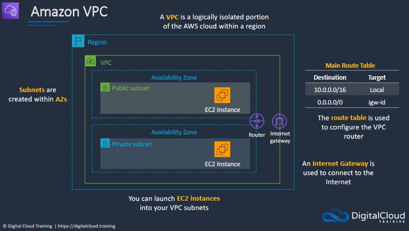
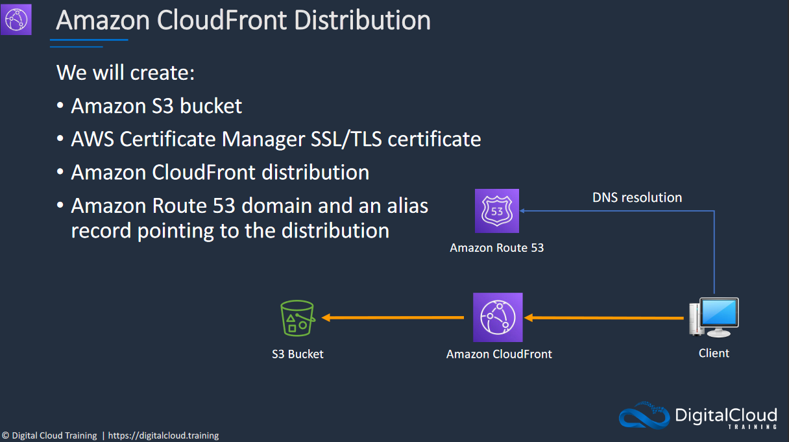
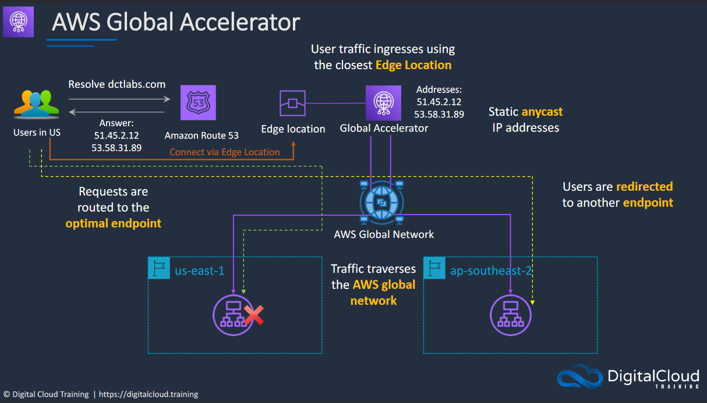

# AWS
# Section 5: 
## IAM Overview (IAM)
### AWS Identity and Access Management (IAM)

AWS Identity and Access Management (IAM) is a service that helps you control access to AWS resources. It allows you to create and manage users, groups, and permissions securely.

### IAM Authentication Methods

IAM Authentication Methods refer to the ways users and services prove their identity to access AWS resources. These methods include username/password, access keys for API calls, and roles assumed by services or federated users.

---
## Amazon VPC

Amazon VPC (Virtual Private Cloud) is a service provided by AWS (Amazon Web Services) that allows you to create an isolated, private network in the cloud. With a VPC, you can define your own network space with IP address ranges, subnets, and security settings. This enables you to run resources like EC2 instances or databases securely and with fine-grained control over network configuration and accessibility.

**Why use a VPC?**: It provides a secure, isolated enviroment for your cloud resources, offering better control over network configuration, improved security, and easy scalability. It resembles a traditional network you'd operate in your own data center.

A subnet, or subnetwork, is a smaller, segmented part of a larger network. It allows you to divide a network into smaller, more manageable pieces for purposes like security, traffic management, or resource allocation. Each subnet has its own unique IP address range, which is a subset of the larger network's IP address range. In the context of an Amazon VPC, you can create multiple subnets to isolate different types of resources or to configure specific access rules.

NAT-gateways is the part that costs money when creating and using VPCs. If you don't know if you're going to use it or don't need it, you can get rid of it by doing this: 

VPC -> NAT gateways -> Actions -> Delete NAT Gateway

When you delete the NAT gateway it's still going to leave behind the elastic IP-adress. You only pay for elastic IPs when you're not using them. In this case we need to delete it by following these steps: 

VPC -> Elastic IPs -> Actions -> Release Elastic IP Addresses

It shouldn't cost us anything since the NAT Gateway was only active for a few minutes and the Elastic IP was only detached for a couple of seconds (from tutorial). 

Why should you use a NAT-gateway? Without a NAT Gateway, resources in private subnets won't be able to access the internet directly. They can still communicate within the VPC and with other AWS services that are configures to allow such traffic. Internet is not a requirement depending on our use case, operating without a NAT Gateway is entirely feasible.

AWS Public Services are accessible over the internet and include services like S3 and EC2. Private Services are only accessible within your VPC, such as VPC endpoints or private RDS instances.

---

## Stateful vs Stateless Firewalls

Stateful and stateless firewalls are two types of firewalls that filter network traffic based on different criteria:

* **Stateful Firewalls:** These keep track of the state of active connections and make decision based on the context of the traffic, such as TCP handshake completion or established sessions. This allows them to apply rules based on the entire communcation session, not just individual packets. Stateful firewalls are more secure and flexible but can require more processing power.

* **Stateless Firewalls:** These filter traffic based on the source and destination without considering the state of the connection. Each packet is inspected individually and either accepted or rejected based on pre-set rules. Stateless firewalls are faster and require less memory because the don't keep track of connection states, but they are generally considered less secure compared to stateful firewalls.

The choice between stateful and stateless firewalling depends on your specific needs for performance, security and complexity

---

## Security Groups & Network ACLs

Security Groups and Network Access Control Lists (ACLs) are both used for configuring network security in Amazon VPC, but they operate at different levels and offer different types of control.

* **Security Groups:** These act as virtual firewalls for instances like EC2, controlling inbound and outbound traffic at the instance level. Security groups are stateful, meaning if you allow an incoming request from an IP, the response is automatically allowed, regardless of outbound rules.

* **Network ACLs:** These are similiar to firewalls that control traffic going in and out of a subnet within your VPC. Unlike Security Groups, Network ACLs are stateless, so you need to specify both inbound and outbound rules explicitly. They offer rule numbering and allow you to create rules that deny traffic, giving you more granular ("grainy") control

Both can be used together for layered security, with Security Groups acting as the first line of defense at the instance level and Network ACLs providing broader subnet-level protection.

## Stateful vs Stateless Applications

Stateful and stateless applications differ in how they manage and utilize data across multiple interactions.

* **Stateful Applications:** These applications maintain state between different interactions or transactions. Information from one session, like user preferences or data, is stored and can be referenced in future sessions. Databases and most interactive applications like shopping carts are examples of stateful applications.

* **Stateless Applications:** These applications do not save any client state between interactions. Each transaction is processed without reference to past or future transactions. Stateless applications are easier to scale horizontally since each request is independent. HTTP and RESTful web services are often stateless. 

The choice between stateful and stateless design depends on your application's needs for scalability, complexity and data persistence.

**What is the difference between horizontal and vertical scaling?**

* **Horizontal:** Adds more machines to your existing setup to distribute the load. **EXAMPLE:** If you have a web app running on a single server, horizontal scaling would involve adding more servers and distributing incoming traffic among them. This is often easier to implement and is more flexible, allowing you to scale out or in based on demand.

* **Vertical:** This involves upgrading the resources on an existing machine, such as adding more RAM, CPU or storage. You're essentially making your individual server more powerful. Vertical scaling often requires downtime for hardware upgrades and has an upper limit defined by the capabilites of the individual servers.

Horizontal scaling is generally more adaptable and can offer better fault tolerance, while vertical scaling is often simpler but has its limitations.

---
# Section 6: Amazon EC2, Auto Scaling, and Load Balancing
# EC2 (Elastic Cloud)

EC2 Provides resizable compute resources in the cloud, making it easier to deploy applications and handle varying workloads. You can launch virtual machines, known as instances, with different configurations of CPU, memory, storage, and  networking capabilities (this is within a VPC). EC2 offers flexibility with options for on-demand pricing, reserved instances, and spot instances, enabling cost optimization based on your needs. It intergrates with many AWS services like Amazon RDS for databases and Amazon S3 for storage, providing a comprehensive enviroment for running applications in the cloud.

**What are Public, Private, and Elastic IP addresses within EC2?**

* **Public IP:** Temporary, internet-reachable address assigned when an EC2 instance is launched.
* **Private IP:** Permanent address for internal VPC communaction, not accessible from the internet.
* **Elastic IP:** Static, public IP you can allocate and keep until you release it. Internet-reachable and can be reassigned to different instances.

Each type serves different use-cases: Public for temporary internet access, Private for internal VPC communication, and Elastic for more control and persistence.

### Public Subnets:
A subnet with a route to the internet, typically via an internet Gateway. Instance in a public subnet can have public IP address and can be aaccessed directly from the internet.

### Private Subnets:

A subnet without direct route to the internet. Instances can communicate within the VPC but can't be accessed directly from the internet. Internet access, if needed, is usually via a NAT Gateway.

### Launching an EC2 instance
See How to guides, Section 6 "How to launch an EC2 instance"

---

# Access Keys and IAM Roles with EC2

Using access keys with EC2 is easier, however you risk exposing information to outsiders

Using roles is instead more secure, however, the initial setup is abit more complex.

# Amazon EC2 Auto Scaling

AWS EC2 Auto Scaling is a feature in Amazon's cloud computing platform that automatically adjusts the number of active EC2 instances based on demand or predefined conditions. It aims to improve application availability and cost efficiency by scaling resources up or down as needed.

# Amazon Elastic Load Balancing

Amazon Elastic Load Balancing (ELB) is a cloud service that automatically distributes incoming application traffic across multiple targets, such as EC2 instances. It improves application availability and fault tolerance by redirecting traffic to healthy instances. ELB supports different types of load balancing including HTTP/HTTPS, TCP, and more.

---
# Section 7: AWS Storage Services
# Amazon EBS and Instance Stores

Amazon Elastic Block Store (EBS) is a cloud storage service designed for use with Amazon EC2 instances. EBS provides scalable and durable block storage, allowing you to attach volumes to your instances for tasks like data storage, backups, and more. It's optimized for both high-performance and high-availability needs.

Amazon Elastic Block Store (EBS) is a cloud storage service for AWS, designed to work with EC2 instances. EBS provides scalable, durable block-level storage that can be easily attached or detached from instances. It supports various performance needs, allows for snapshots, and offers built-in encryption. It's commonly used for databases and other applications requiring persistent storage.

EBS Snapshots are point-in-time backups of Amazon Elastic Block Store (EBS) volumes. They provide a way to save the current state of a volume, making it easier to backup data, migrate volumes, and improve disaster recovery. Snapshots are incremental, meaning they only capture changes made since the last snapshot, which saves storage space and cost.

# Amazon Elastic File System (EFS)

Amazon Elastic File System (EFS) is a cloud storage service from AWS designed to provide scalable, elastic, and shared file storage for use with both AWS cloud services and on-premises resources. Unlike block storage services like EBS, EFS allows multiple EC2 instances to access the file system simultaneously, making it ideal for applications that require shared access to files. EFS is commonly used for content management systems, data analytics applications, and backup solutions.

# Amazon Simple Storage Service (S3)

Amazon Simple Storage Service (S3) is a cloud storage service from AWS that provides scalable, durable, and secure object storage. Unlike block and file storage options like EBS and EFS, S3 is optimized for storing unstructured data objects like files, images, and backups. It offers high availability, versioning, and fine-grained access control. S3 is widely used for backup solutions, data archiving, and content distribution.

File Storage uses a folder hierarchy and is good for traditional applications requiring a file system structure. It has limited metadata and is commonly used in network-attached storage (NAS) systems.

Object Storage stores data as individual objects with rich metadata. It's ideal for unstructured data like media files and is commonly used in cloud storage solutions like Amazon S3.

---
# Section 8: Database Services
# Amazon Relational Database Service (RDS)

Amazon RDS (Relational Database Service) is a managed database service provided by AWS. It supports multiple database engines like MySQL, PostgreSQL, SQL Server, and Oracle. RDS handles routine database tasks such as backups, patch management, and failover, allowing you to focus on application development. It's designed for ease of setup, scalability, and automated updates.

Vertical scaling is well-suited for applications that require higher performance from a single database instance, as opposed to distributing loads across multiple instances (horizontal scaling). It's a quick way to boost performance for CPU or memory-bound workloads but is generally limited by the maximum capabilities of the most powerful instance type available.

### Disaster Recovery:

Amazon RDS supports automated backups, manual snapshots, and Multi-AZ deployments for high availability and easy recovery.

### Scaling Out:

For horizontal scaling, RDS offers Read Replicas to distribute read traffic across multiple instances, improving performance for read-heavy workloads.

# Amazon DynamoDB (noSQL)

Amazon DynamoDB is a fully managed NoSQL database service provided by AWS. It's designed for high-availability and offers seamless scalability. DynamoDB is commonly used for applications requiring low-latency data access, and it supports both key-value and document data models. It also offers features like auto-scaling, in-memory caching, and backup capabilities, making it suitable for mobile, web, and IoT applications.

---
# Section 9: Automation and DevOps on AWS
# Infrastructure as Code with AWS CloudFormation

AWS CloudFormation is a service that helps you model and set up Amazon Web Services resources so you can spend less time managing those resources and more time focusing on your applications. It allows you to use a template file to define all the resources needed for your application, making it easier to manage, replicate, and version-control your AWS infrastructure. CloudFormation automates and simplifies the task of repeatedly and predictably creating and managing AWS resources.

# Platform as a Service with AWS Elastic Beanstalk

AWS Elastic Beanstalk is a Platform as a Service (PaaS) offering from Amazon Web Services that automates the deployment and scaling of web applications and services. You provide the code, and Elastic Beanstalk handles the underlying infrastructure, including server provisioning, load balancing, and automatic scaling. It supports multiple programming languages and frameworks, making it a flexible choice for developers who want to focus on code rather than infrastructure management.

# Continuous Integration and Continuous Delivery (CI/CD)

CI/CD stands for Continuous Integration and Continuous Deployment, key practices in the DevOps methodology.

    Continuous Integration (CI): Developers regularly merge their code changes into a central repository, where automated tests are run to catch bugs early.

    Continuous Deployment (CD): Automated delivery of code to production without manual intervention, ensuring that you can release new changes to customers quickly and efficiently.

Together, CI/CD aims to minimize the time between writing code and deploying it to production, while ensuring that the software remains in a deployable state at all times. This leads to faster development cycles, quicker bug fixes, and more stable releases.

---
# Section 10: DNS, Caching, and Performance Optimization
# Amazon Route 53 DNS:

Amazon Route 53 is a scalable Domain Name System (DNS) web service from AWS designed to route user requests to endpoints in a globally distributed, low-latency manner. It offers features like domain registration, DNS routing, and health checking of resources within your environment. Route 53 is commonly used to route traffic to various AWS services, such as EC2 instances, S3 buckets, and more, as well as to non-AWS endpoints. It's designed for both high availability and security, making it suitable for mission-critical applications.

Amazon Route 53 handles DNS resolution by translating domain names into IP addresses. When a user accesses a URL, a DNS query is sent to Route 53, which checks its records and routing policies to determine the correct IP address. The IP is then sent back to the user's device, enabling it to connect to the target service. Route 53 offers high availability and low-latency responses.

Amazon Route 53 supports various DNS record types to accommodate different needs for domain name resolution and traffic routing

# Amazon CloudFront

CloudFront is all about performance (latency for user etc)

Amazon CloudFront is a Content Delivery Network (CDN) service provided by AWS. It distributes content globally with low latency and high transfer speeds to meet the needs of web applications and services. CloudFront is integrated with other Amazon services, allowing seamless content delivery and compute functionalities. It caches copies of your static and dynamic content at edge locations around the world, enabling quicker delivery and reduced load on your origin servers. Features like SSL/TLS encryption, DDoS protection, and geo-restriction add security layers to your content distribution. It's commonly used to accelerate website load times, stream media, and securely deliver APIs and data.

# AWS Global Accelerator

Works like a networking service, gets you to the best end-point.

AWS Global Accelerator improves application performance and availability by routing user traffic through AWS's global network. It provides static IP addresses for consistent access and automatically directs traffic to the best AWS endpoint based on factors like health and location. It's commonly used for low-latency, high-availability applications like online gaming and streaming.

# Section 11: Containerns and Serverless Computing
# Docker Containers on Amazon ECS

# How to guides: 

## Section 5:
* How to create IAM User and Group? **28**
* How to create a custom VPC? **30**
* How to create a Security Group? **32**
* How to configure AWS CLI (Command Line Interface)? **33** 

## Section 6: 
* How to launch an EC2 Instance? **36**
* How to connect to EC2? **37**
* How to practise with Access Keys and IAM Roles? **39**
* How to create a website with User Data? **40**
* How to create an Auto Scaling Group? **42**
* How to create a Scaling Policy? **43**
* How to create an Application Load Balancer? **45**

## Section 7:
* How to create and attach an EBS Volume **48**
* EBS Snapshots and AMIs **49**
* How to Create an Amazon EFS Filesystem **51**
* How to work with S3 Buckets and Objects **53**
* How to create an S3 Static Website **54**

## Section 8:
* How to create an Amazon RDS Database **57**
* How to add an Amazon RDS Read Replica **58**
* How to create an Amazon DynamoDB Table **60**

# Section 9:
* How to create and update stacks **62**
* How to deploy a VPC using CloudFormation **63**
* How to create an Elastic Beanstalk Application **65**
* How to create an AWS CodeCommit Repository **67**
* AWS CodePipeline with AWS Elastic Beanstalk **68**

# Section 10: 
* How to register a domain using Route 53 **71**
* How to create an Amazon CloudFront Distribution **73**

# Section 11:
* How to create an AWS Fargate Cluster **77**
* How to create an AWS Lambda Function **79**
* How to create a Serverless Application **81**
* How to create a REST API with Lambda Proxy Integration **84**
